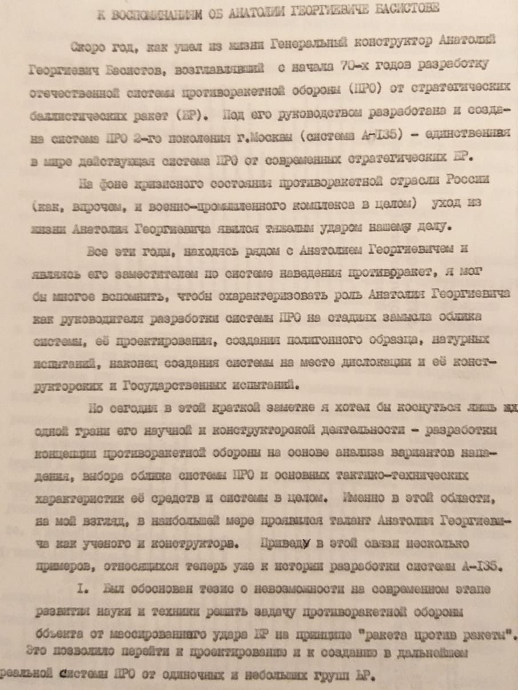
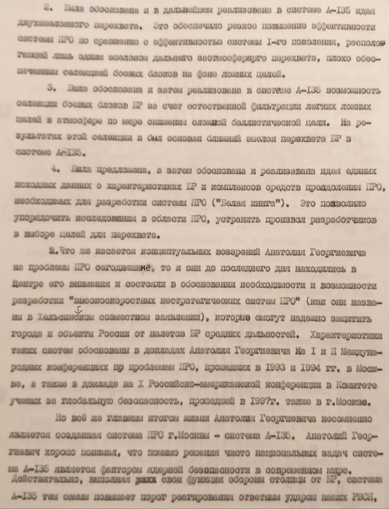
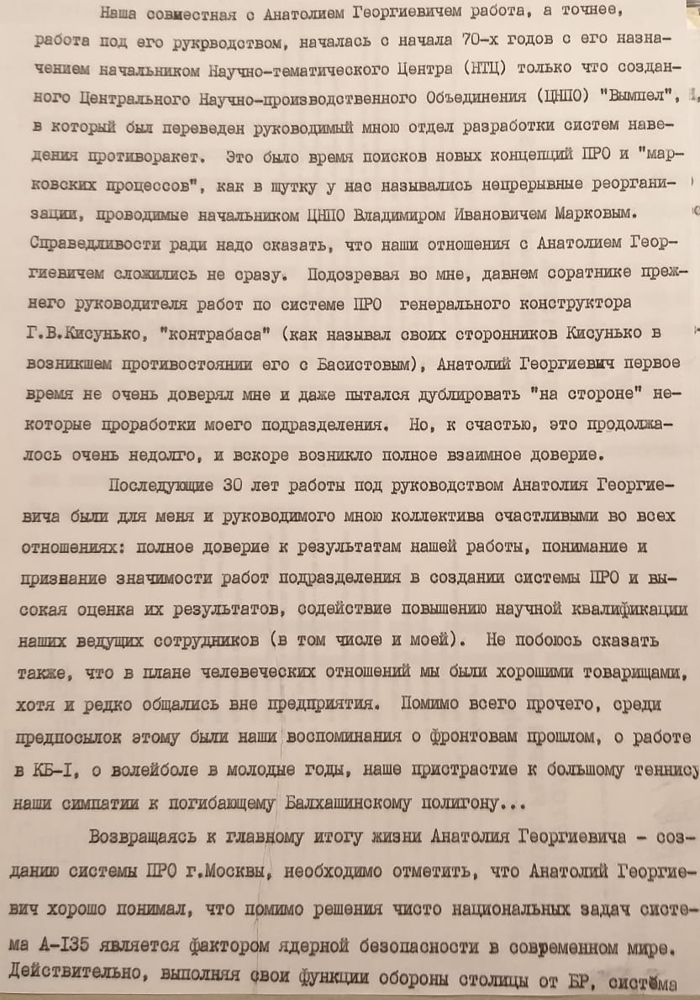
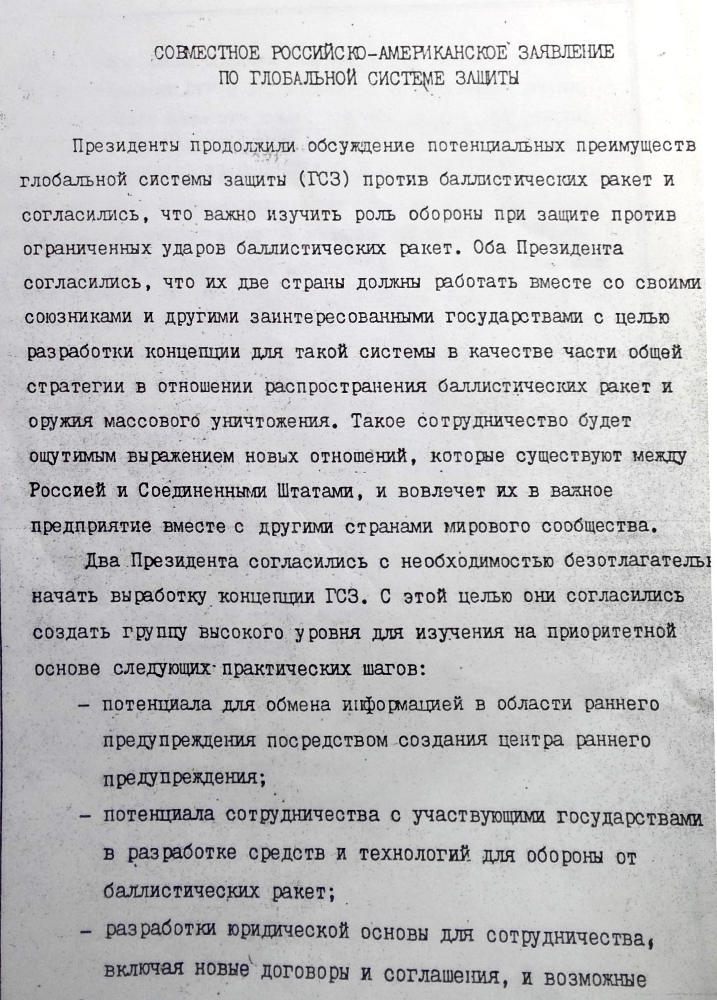
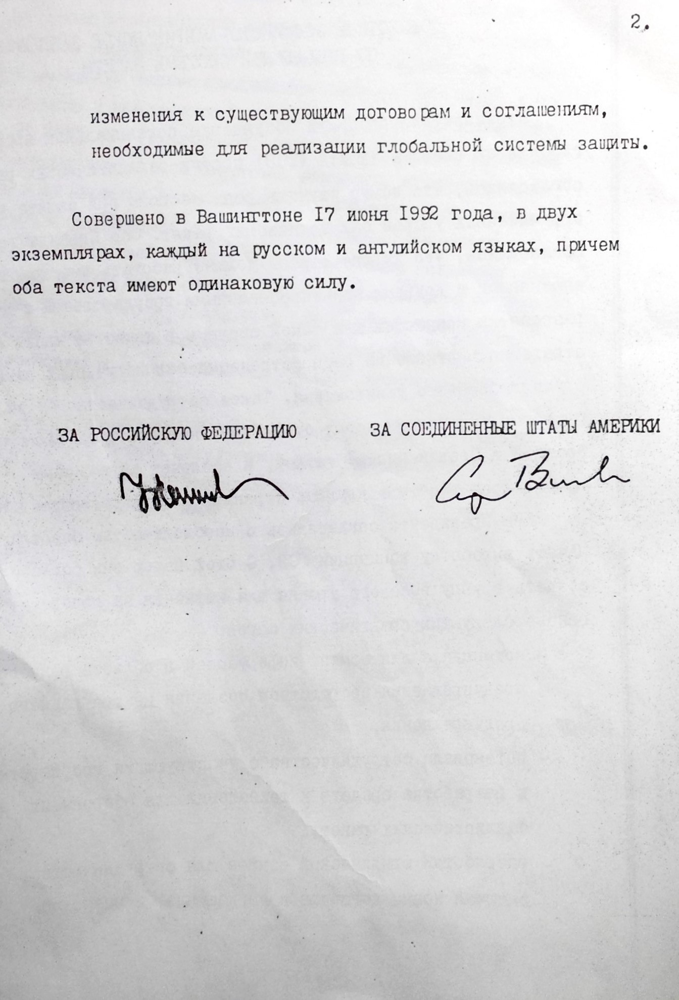
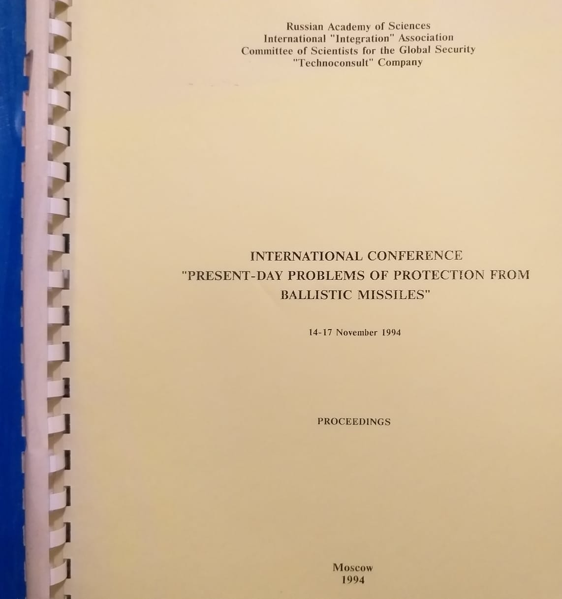

# Наследие

*Памяти Генерального конструктора А. Г. Басистова*

Анатолия Георгиевича Басистова с нами нет вот уже 10 лет. Участник Великой Отечественной войны, которую окончил штурманом авиаполка, он в 1950 г. был откомандирован в знаменитое КБ-1, где в 1954 г. стал заместителем главного конструктора системы ПВО С-25, проводил её полигонные испытания, осуществлял техническое руководство строительством головного комплекса. Руководил разработкой системы ПВО Ленинграда. За техническое руководство разработкой, испытаниями и вводом в строй первого в стране зенитного ракетного комплекса дальнего действия С-200 был удостоен звания Героя социалистического труда, а после постановки на боевое дежурство созданной под его руководством системы ПРО г.Москвы стал лауреатом Государственной премии РФ. При жизни А.Г.Басистова наша страна в области ПРО значительно опережала США &mdash; и в этом велика его личная заслуга. Его имя вписано в словарь Международного биографического центра рядом с именем, например, известнейшего кардиолога Кристиана Барнарда.

В день его памяти 16 сентября многие с сегодняшних позиций пытаются осмыслить судьбы противоракетной обороны, проблемы, возникающие с появлением элементов глобальной американской системы ПРО у российских границ, а также возможности реализации значительного потенциала развития, заложенного Анатолием Георгиевичем более 30 лет назад при разработке системы ПРО г. Москвы и до сих пор не востребованного даже после выхода США из Договора об ограничении систем ПРО.

А.Г.Басистов был руководителем работ по программе, которую многие тогда называли &laquo;антиСОИ&raquo; &mdash; нашему ответу рейгановской стратегической оборонной инициативе. Эта программа много лет служила катализатором развития высоких технологий в оборонных отраслях, увязывая деятельность министерств и ведомств по созданию стратегической системы обороны нового поколения, в ней участвовали сотни крупных научно-производственных комплексов. Их деятельность координировал и направлял возглавляемый Анатолием Георгиевичем межведомственный научный совет, куда вошли многие видные учёные, такие, как Юлий Борисович Харитон, активно взаимодействовавший с Анатолием Георгиевичем и вне рамок регламента этого совета. Причём практически по всем направлениям исследований требовалось проведение масштабных экспериментов, закупалось прецизионное оборудование, значительные ресурсы расходовались на создание новой элементной базы ввиду того, что работы велись в интересах национальной безопасности. 

В итоге 20 лет назад была создана и успешно прошла государственные испытания фантастически сложная многоуровневая система &mdash; по сути боевой робот ракетно-космической обороны. Она функционирует при любых изменениях обстановки полностью автоматически &mdash; человек не способен разобраться в многообразии процессов, происходящих при перехвате МБР в отведённое для этого время, тем более в условиях жесточайших помех, включая воздействие ядерных взрывов. Встроенная в контур управления организацией ответных действий при ракетно-ядерном ударе &mdash; наряду с системой предупреждения о ракетном нападении &mdash; эта система существенно повышает достоверность данных СПРН за счёт уникальных информационных возможностей входящей в неё МРЛС &laquo;Дон-2Н&raquo;, а данные о результатах селекции и эшелонированного перехвата боевых блоков МБР уже не оставляют места для сомнений о применении противником ядерного оружия и служат для своевременной подготовки решений об ответных действиях, обеспечивая неотвратимость возмездия. К слову сказать, именно необходимость селекции боевых блоков вызвала к жизни &mdash; как раз 40 лет назад, после успешных испытаний в США МБР &laquo;Минитмен-3&raquo; с разделяющимися головными частями индивидуального наведения &mdash; проблему перехода к созданию стратегических систем ПРО нового поколения.

Проблема была решена концентрацией усилий многих десятков коллективов, работавших в составе ЦНПО &laquo;Вымпел&raquo; и в кооперации с ним под руководством А.Г.Басистова за счёт целого ряда научно-технических прорывов в различных оборонных отраслях, к которым тогда относились наряду с организациями, занятыми разработкой ядерного оружия, баллистических ракет и прочего оружия, и многие другие, в том числе работающие в области радиоэлектроники и вычислительной техники. Наращивался их кадровый потенциал, привлекались выпускники лучших ВУЗов страны, а в МФТИ были созданы новые базовые кафедры, одной из которых заведовал Анатолий Георгиевич.

Важно подчеркнуть, что система ПРО г.Москвы полностью отвечала условиям Договора об ограничении систем ПРО, причём Анатолий Георгиевич многократно привлекался к работе Постоянной консультативной комиссии по этому Договору, в задачи которой входило также содействие осуществлению соглашений о мерах по уменьшению опасности ядерной войны и конецформыначалоформыограничению стратегических наступательных вооружений (включая ОСВ-1 и ОСВ-2).

Большую роль в работах по &laquo;антиСОИ&raquo; сыграло участие академических институтов, Сибирскому отделению АН СССР, в частности, было поручено развитие направления системного программирования, что привело впоследствии к созданию отраслевых предприятий для разработки специализированного программно-алгоритмического обеспечения. Да и сама Академия наук в то время в значительной степени формировалась за счёт лидеров &laquo;оборонки&raquo;, в их числе был и А.Г.Басистов. Его теоретические и прикладные работы значительно продвинули технологии создания средств радиолокации, информатики, оптоэлектроники, связи. Благодаря его участию почти полвека назад значительный импульс получила разработка отечественных многопроцессорных вычислительных комплексов с быстродействием, позволяющим в реальном масштабе времени вести приём и обработку сигнальной и траекторной информации одновременно по многим десяткам целей, имеющих космические скорости, и при этом вырабатывать и передавать на борт сразу нескольких противоракет команды управления, а главное &mdash; управлять всеми этими процессами автоматически.

На долю А.Г.Басистова выпало и испить горечь низведения роли созданной им стратегической ПРО, этого сложнейшего научно-технического шедевра, до обычного оборонительного комплекса, от которого, того и гляди, останется работоспособной только информационная часть, а она в этом случае выводится из строя одной ракетой, даже если нас оповестят о её старте, как о &laquo;случайном пуске&raquo;. Но это &mdash; последствия политического (а отнюдь не организационно-технического) решения, в результате которого финансирование на ПРО сократилось в последние годы жизни Анатолия Георгиевича на два порядка! Уже после прекращения финансирования ему стоило больших усилий довести до конца процедуру постановки системы на боевое дежурство (спустя полдесятилетия после успешных государственных испытаний!), что, безусловно, окончательно подорвало его здоровье.

Проблема защиты от ракетных средств нападения все более остро встаёт с учётом их неуклонного распространения в мире, роста вероятности их применения террористическими организациями. Растущее отставание в этой наиболее высокотехнологичной области, отсутствие экспериментальных результатов, позволяющих хотя бы сформировать исходные данные для таких разработок, лишает Россию возможности адекватно и своевременно реагировать на возникающие угрозы. При этом главное сегодня в стратегическом сдерживании &mdash; развивать направление создания автоматически адаптирующейся к изменению внешней обстановки интегрированной системы, собирающей и объединяющей на разных уровнях разнородную информацию о сотнях тысяч объектов и их характеристиках, и способной автоматически, как в системе ПРО г.Москвы, решать задачи перехвата МБР одновременно с задачами перехвата БР средней дальности, в том числе маневрирующих, а также крылатых ракет. Алгоритмы поддержки принятия юридически обязывающих решений на каждом иерархическом уровне управления должны формировать соответствующий текущей обстановке &laquo;порог срабатывания&raquo; на основе критериев, определяемых концепцией национальной безопасности, военной доктриной и союзническими обязательствами, учитывая текущие возможности и эффективность оборонительных систем, в том числе ПРО и СПРН.

При этом получаемая при наблюдении воздушно-космического пространства и поверхности Земли оптическая и радиолокационная информация высокого качества должна использоваться при формировании единого информационно-управляющего поля, обеспечивающего принятие и реализацию оперативных решений в разнообразных кризисных ситуациях, в том числе связанных с нарастающими угрозами природных и техногенных катастроф, например, при обнаружении пожаров, мониторинге транспортировки опасных грузов и т.д. Таким образом, научно-технический задел, полученный в работах, выполнявшихся под руководством А.Г.Басистова, может послужить основой надведомственной системы антикризисного управления экономикой, позволяющей и в мирное время на основе анализа разнородной информации и прогноза наиболее вероятного развития событий понизить риски, а также минимизировать ущерб в условиях внезапных катаклизмов.

---

*Академики РАН: Бондур В.Н., Велихов Е.П., Марчук Г.И., Михайлов В.Н., Савин.А.И., Федосов Е.А.*

*Генеральные и главные конструкторы, сотрудники организаций ОПК: Айтхожин Н.А., Альперович К.С., Амочкин В.М., Баранов Н.А., Баршай Е.Б., Басистов В.А., Безель Я.В., Власко-Власов К.А., Воскобоев Ю.Ф., Галкина Л.П., Дежин В.Н., Доброхотов В.Н., Дудко В.Г., Ефремов Г.А., Зельников И.П., Ким А.К., Колганов С.К., Колесса А.Е., Кременцов В.И., Кудрявцев Л.И., Кузьмин А.А., Курикша А.А., Литвинов В.В., Лобанов Б.С., Мирзоева Л.А., Мирошников М.М., Михайлов Н.В., Морозов В.Г., Назаренко И.П., Ненартович Н.Э., Панкеев А.А., Пантелеев Б.М., Пивоваров А.В., Подлепа С.А., Рахманов А.А., Репин В.Г., Родин А.Л., Пивоваров Л.В., Сазонов В.В., Сапрыкин С.Д., Свитич В.М., Селезнёв И.С., Слока В.К., Смирнов В.М., Стоянов М.С., Ступин Д.Д., Сумин А.С., Суханов С.А., Сухарев Е.М., Сухомлин В.В., Тарасов Е.В., Тищенко С.О., Турко Н.И., Хюпенен А.И., Шилин В.Д., Шорин М.М.*

---

---

---

Для подтверждения подлинности списка подписавших (лично или с использованием средств связи) в эпоху "фейков" приводим фотографию последней страницы полученного по факсу текста с подписью Герберта Александровича Ефремова и его замечанием, отражающим его личную точку зрения и свидетельствующим о внимательном прочтении им полученной статьи "Наследие". Чрезмерную категоричность его высказывания можно поставить под сомнение ввиду возобновления работ по системе А-235. 

[Пуск А-235 "НУДОЛЬ" Новой гиперзвуковой ракеты ПРО для ВКС России](https://m.youtube.com/watch?v=Z3jW_AGsNvo)

В последние годы жизни настольным документом А.Г. Басистова было это совместное российско-американское заявление по глобальной системе защиты. Постоянно подчёркивая практическую нереализуемость выявления в обнаруженном налёте как МБР, так и ОТБР, вне атмосферы боевых блоков среди имитирующих их многочисленных ложных целей, а также выделения среди них блоков, оснащённых ядерными зарядами, Анатолий Георгиевич, опираясь на это заявление, поддерживал разработки систем ПРО ТВД на основе заделов по стратегической ПРО, участвовал в качестве сопредседателя международных конференций по проблемам защиты от БР, прошедших в 1993 и 1994 гг.

А.Г. Басистов подчёркивал необходимость постоянного совершенствования и развития технологий ПРО в том числе за счёт расширения круга решаемых задач в этой области. На этом фото страница с выводами по проекту предложений о разработке эшелонированной ПРО ТВД с авиационными модулями обнаружения и поражения БР на восходящих участках полёта, а также на стартовых позициях и маршрутах выдвижения к ним. Его добавление "ПРО г.Москвы и Центрального промышленного района России" после слов "ПРО ТВД" в пунктах 2 и 3 он объяснил тем, что в региональном военном конфликте ТВД может практически сразу распространиться на ЦПР России.

